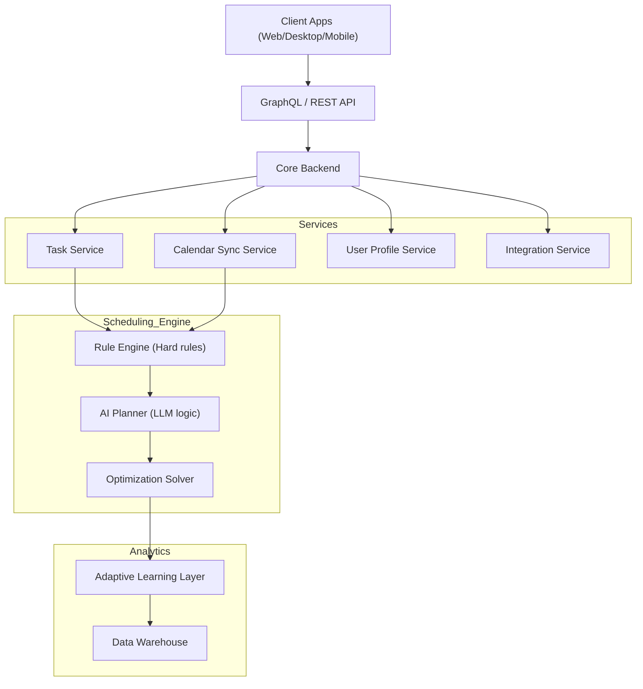

# 🧠 Smart Scheduling Engine — Technical Architecture

## 🏗 High-Level System Architecture

---

## 🧩 Core Engine Components

### 1️⃣ Constraint & Rule Engine (Deterministic Layer)
Handles "physics of time":
- Working hours, hard deadlines, duration, dependencies, buffer times.
- **Tech**: OR-Tools (Google) / Mixed Integer Programming.

### 2️⃣ AI Planning Layer (Reasoning Layer)
Generates *planning intent*:
- "Cluster marketing tasks", "Heavy cognitive tasks in morning".
- **Tech**: Lightweight LLM for reasoning + Embedding-based memory.

### 3️⃣ Optimization Solver
Places weighted priorities into optimal slots:
- Maximizes deep-work blocks, minimizes context switching.

### 4️⃣ Adaptive Learning Layer
Learns user rhythms:
- Completion velocity, energy-task alignment, true duration patterns.

---

## 🔁 Real-Time Rescheduling Flow
1. **Conflict Detected** (Meeting shift)
2. **Impact Analysis** (Identify affected tasks)
3. **Re-optimization** (Localized run)
4. **Preservation** (Keep original plan where possible)
5. **Notification** ("Your 3pm strategy moved to 9am tomorrow")
